# Technical Architecture Diagrams & Component Specifications

## Architecture Decision Records (ADRs)

### ADR-001: Microservices Architecture Adoption

**Status**: Approved
**Date**: 2025-08-06
**Decision**: Migrate from monolithic Supabase backend to microservices architecture

**Context**: Current monolithic architecture limits scalability and creates single points of failure for enterprise-scale requirements.

**Decision Drivers**:
- Need to scale to 100K+ concurrent users
- Service isolation for fault tolerance
- Independent deployment and scaling
- Technology diversity for optimal solutions

**Consequences**:
- **Positive**: Better scalability, fault isolation, technology flexibility
- **Negative**: Increased complexity, network latency between services
- **Mitigation**: Service mesh, comprehensive monitoring, API gateway

---

### ADR-002: Multi-Database Strategy

**Status**: Approved  
**Date**: 2025-08-06
**Decision**: Implement polyglot persistence with specialized databases

**Context**: Single PostgreSQL database cannot optimally handle diverse data patterns (OLTP, search, analytics, caching).

**Rationale**:
- PostgreSQL: ACID transactions, relational data
- ElasticSearch: Full-text search, geospatial queries
- Redis: Caching, session storage, real-time data
- ClickHouse: Analytics, time-series data
- MongoDB: Document storage, flexible schemas

---

### ADR-003: API Gateway Pattern

**Status**: Approved
**Date**: 2025-08-06  
**Decision**: Implement Kong + Apollo GraphQL Federation

**Context**: Direct service-to-service communication creates tight coupling and makes cross-cutting concerns difficult to manage.

**Benefits**:
- Centralized authentication and authorization
- Rate limiting and throttling
- Request/response transformation
- API versioning and backward compatibility
- Comprehensive logging and monitoring

---

## C4 Architecture Diagrams

### Level 1: System Context Diagram

```mermaid
graph TB
    User[👤 End Users<br/>Consumers seeking coupons]
    Business[🏢 Business Owners<br/>Coupon providers]
    Admin[👨‍💼 System Administrators<br/>Platform management]
    
    Saverly[🎯 Saverly Platform<br/>Coupon Marketplace]
    
    Stripe[💳 Stripe<br/>Payment Processing]
    GoogleMaps[🗺️ Google Maps API<br/>Location Services]
    SendGrid[📧 SendGrid<br/>Email Services]
    Twilio[📱 Twilio<br/>SMS Services]
    
    User --> Saverly
    Business --> Saverly
    Admin --> Saverly
    
    Saverly --> Stripe
    Saverly --> GoogleMaps
    Saverly --> SendGrid
    Saverly --> Twilio
    
    style Saverly fill:#e1f5fe
    style User fill:#c8e6c9
    style Business fill:#fff3e0
    style Admin fill:#f3e5f5
```



### Level 2: Container Diagram

```mermaid
graph TB
    subgraph "Client Applications"
        WebApp[🌐 Web Application<br/>React + TypeScript<br/>Progressive Web App]
        MobileApp[📱 Mobile Application<br/>React Native<br/>(Future)]
        AdminPanel[⚙️ Admin Panel<br/>React + Admin UI<br/>Management Interface]
    end
    
    subgraph "API Layer"
        APIGateway[🚪 API Gateway<br/>Kong + Apollo GraphQL<br/>Authentication & Routing]
        LoadBalancer[⚖️ Load Balancer<br/>AWS ALB<br/>Traffic Distribution]
    end
    
    subgraph "Microservices"
        UserService[👤 User Service<br/>Node.js + Express<br/>Authentication & Profiles]
        BusinessService[🏢 Business Service<br/>Node.js + Express<br/>Business Management]
        CouponService[🎫 Coupon Service<br/>Node.js + Express<br/>Coupon Lifecycle]
        RedemptionService[✅ Redemption Service<br/>Python + FastAPI<br/>QR & Validation]
        NotificationService[🔔 Notification Service<br/>Node.js + Express<br/>Communications]
        AnalyticsService[📊 Analytics Service<br/>Python + FastAPI<br/>Insights & ML]
        PaymentService[💳 Payment Service<br/>Node.js + Express<br/>Billing & Subscriptions]
    end
    
    subgraph "Data Layer"
        PostgreSQL[🐘 PostgreSQL<br/>Primary Database<br/>ACID Transactions]
        Redis[🔴 Redis Cluster<br/>Caching & Sessions<br/>Real-time Data]
        ElasticSearch[🔍 ElasticSearch<br/>Search Engine<br/>Full-text & Geo]
        ClickHouse[📈 ClickHouse<br/>Analytics DB<br/>Time-series Data]
        MongoDB[🍃 MongoDB<br/>Document Store<br/>Flexible Schemas]
    end
    
    WebApp --> LoadBalancer
    MobileApp --> LoadBalancer
    AdminPanel --> LoadBalancer
    LoadBalancer --> APIGateway
    
    APIGateway --> UserService
    APIGateway --> BusinessService
    APIGateway --> CouponService
    APIGateway --> RedemptionService
    APIGateway --> NotificationService
    APIGateway --> AnalyticsService
    APIGateway --> PaymentService
    
    UserService --> PostgreSQL
    UserService --> Redis
    BusinessService --> PostgreSQL
    BusinessService --> ElasticSearch
    CouponService --> PostgreSQL
    CouponService --> ElasticSearch
    RedemptionService --> PostgreSQL
    RedemptionService --> ClickHouse
    NotificationService --> MongoDB
    NotificationService --> Redis
    AnalyticsService --> ClickHouse
    AnalyticsService --> PostgreSQL
    PaymentService --> PostgreSQL
    PaymentService --> Redis
    
    style APIGateway fill:#e3f2fd
    style LoadBalancer fill:#e8f5e8
```

### Level 3: Component Diagram - User Service

```mermaid
graph TB
    subgraph "User Service Components"
        AuthController[🔐 Authentication Controller<br/>JWT validation, Login/Logout]
        UserController[👤 User Profile Controller<br/>CRUD operations, Profile management]
        SubscriptionController[💰 Subscription Controller<br/>Billing, Plan management]
        
        AuthMiddleware[🛡️ Authentication Middleware<br/>Token validation, Rate limiting]
        ValidationMiddleware[✔️ Validation Middleware<br/>Input sanitization, Schema validation]
        
        UserRepository[📊 User Repository<br/>Database abstraction layer]
        StripeService[💳 Stripe Service<br/>Payment integration]
        EmailService[📧 Email Service<br/>Notification integration]
        
        UserModel[👥 User Domain Model<br/>Business logic, Validation rules]
        SubscriptionModel[💼 Subscription Model<br/>Billing logic, Plan features]
    end
    
    subgraph "External Dependencies"
        PostgreSQLConn[🐘 PostgreSQL Connection<br/>User profiles, Subscription data]
        RedisConn[🔴 Redis Connection<br/>Session storage, Cache]
        StripeAPI[💳 Stripe API<br/>Payment processing]
        EmailAPI[📧 SendGrid API<br/>Email delivery]
    end
    
    AuthController --> AuthMiddleware
    UserController --> ValidationMiddleware
    SubscriptionController --> AuthMiddleware
    
    AuthController --> UserRepository
    UserController --> UserRepository
    SubscriptionController --> UserRepository
    SubscriptionController --> StripeService
    
    UserRepository --> UserModel
    UserRepository --> SubscriptionModel
    StripeService --> SubscriptionModel
    EmailService --> UserModel
    
    UserRepository --> PostgreSQLConn
    AuthMiddleware --> RedisConn
    StripeService --> StripeAPI
    EmailService --> EmailAPI
    
    style AuthController fill:#ffecb3
    style UserController fill:#c8e6c9
    style SubscriptionController fill:#f8bbd9
```



### Level 4: Code Diagram - Authentication Flow

```mermaid
sequenceDiagram
    participant User as 👤 User
    participant WebApp as 🌐 Web App
    participant APIGateway as 🚪 API Gateway
    participant UserService as 👤 User Service
    participant Redis as 🔴 Redis
    participant PostgreSQL as 🐘 PostgreSQL
    participant Stripe as 💳 Stripe API
    
    User->>WebApp: Enter credentials
    WebApp->>APIGateway: POST /auth/login
    APIGateway->>UserService: Forward request
    
    UserService->>PostgreSQL: Validate credentials
    PostgreSQL-->>UserService: User data
    
    UserService->>UserService: Generate JWT tokens
    UserService->>Redis: Store refresh token
    
    UserService->>Stripe: Fetch subscription status
    Stripe-->>UserService: Subscription data
    
    UserService-->>APIGateway: JWT + user profile
    APIGateway-->>WebApp: Authentication response
    WebApp-->>User: Redirect to dashboard
    
    Note over User,Stripe: Authentication complete with subscription status
```



---

## Data Flow Diagrams

### Coupon Redemption Flow


### Real-time Analytics Data Pipeline


---

## Technology Evaluation Matrix

### Backend Technology Comparison

| Technology | Performance | Scalability | Ecosystem | Learning Curve | Enterprise Support | Score |
|------------|-------------|-------------|-----------|----------------|-------------------|-------|
| **Node.js + Express** | 8/10 | 9/10 | 10/10 | 7/10 | 8/10 | **42/50** |
| **Python + FastAPI** | 9/10 | 8/10 | 9/10 | 8/10 | 7/10 | **41/50** |
| **Java + Spring Boot** | 7/10 | 10/10 | 9/10 | 6/10 | 10/10 | **42/50** |
| **Go** | 10/10 | 10/10 | 7/10 | 7/10 | 6/10 | **40/50** |

**Decision**: Node.js for most services, Python for analytics/ML services

### Database Technology Comparison

| Database | Performance | Scalability | Consistency | Maintenance | Cost | Score |
|----------|-------------|-------------|-------------|-------------|------|-------|
| **PostgreSQL** | 8/10 | 7/10 | 10/10 | 8/10 | 9/10 | **42/50** |
| **MongoDB** | 7/10 | 9/10 | 6/10 | 7/10 | 8/10 | **37/50** |
| **ElasticSearch** | 9/10 | 9/10 | 7/10 | 6/10 | 7/10 | **38/50** |
| **Redis** | 10/10 | 8/10 | 8/10 | 9/10 | 9/10 | **44/50** |
| **ClickHouse** | 10/10 | 10/10 | 8/10 | 7/10 | 8/10 | **43/50** |

**Decision**: Polyglot persistence with specialized databases for different use cases

### Cloud Provider Comparison

| Provider | Services | Cost | Performance | Global Reach | Enterprise Support | Score |
|----------|----------|------|-------------|--------------|-------------------|-------|
| **AWS** | 10/10 | 7/10 | 9/10 | 10/10 | 10/10 | **46/50** |
| **Google Cloud** | 9/10 | 8/10 | 9/10 | 9/10 | 9/10 | **44/50** |
| **Azure** | 9/10 | 7/10 | 8/10 | 9/10 | 10/10 | **43/50** |
| **Multi-cloud** | 8/10 | 6/10 | 8/10 | 10/10 | 8/10 | **40/50** |

**Decision**: AWS primary with Google Cloud secondary for specific services

---

## Component Interaction Specifications

### API Gateway Configuration

```yaml
# Kong API Gateway Configuration
services:
  - name: user-service
    url: http://user-service:3000
    routes:
      - name: auth-routes
        paths: ["/v1/auth", "/v1/users"]
        methods: ["GET", "POST", "PUT", "DELETE"]
    plugins:
      - name: rate-limiting
        config:
          minute: 100
          hour: 1000
      - name: jwt
        config:
          secret_is_base64: false
          key_claim_name: iss

  - name: coupon-service  
    url: http://coupon-service:3000
    routes:
      - name: coupon-routes
        paths: ["/v1/coupons", "/v1/search"]
        methods: ["GET", "POST", "PUT", "DELETE"]
    plugins:
      - name: rate-limiting
        config:
          minute: 200
          hour: 2000
      - name: response-transformer
        config:
          add:
            headers:
              - "X-Service: coupon-service"

# GraphQL Federation Gateway
federation:
  services:
    - name: user-subgraph
      url: http://user-service:3000/graphql
    - name: business-subgraph  
      url: http://business-service:3000/graphql
    - name: coupon-subgraph
      url: http://coupon-service:3000/graphql
  
  supergraph:
    listen: 4000
    introspection: true
    playground: true
    cors:
      origin: ["https://saverly.com", "https://admin.saverly.com"]
```

### Message Queue Configuration

```yaml
# Apache Kafka Configuration
kafka:
  cluster:
    brokers: 3
    replication-factor: 3
    min-insync-replicas: 2
  
  topics:
    - name: user.events
      partitions: 10
      retention: 7d
      cleanup.policy: delete
    
    - name: coupon.events
      partitions: 20
      retention: 30d
      cleanup.policy: delete
    
    - name: redemption.events
      partitions: 50
      retention: 365d
      cleanup.policy: compact
    
    - name: analytics.events
      partitions: 100
      retention: 90d
      cleanup.policy: delete

# Redis Configuration
redis:
  cluster:
    nodes: 6
    replicas: 1
  
  databases:
    session-store:
      db: 0
      ttl: 24h
      max-memory: 2GB
    
    api-cache:
      db: 1
      ttl: 1h
      max-memory: 4GB
    
    rate-limiting:
      db: 2
      ttl: 1h
      max-memory: 1GB
```

### Database Connection Configuration

```typescript
// Database Connection Pool Configuration
export const databaseConfig = {
  // PostgreSQL Primary
  postgresql: {
    primary: {
      host: process.env.DB_PRIMARY_HOST,
      port: 5432,
      database: 'saverly_production',
      pool: {
        min: 10,
        max: 100,
        acquire: 30000,
        idle: 10000
      },
      retry: {
        max: 3,
        timeout: 5000
      }
    },
    
    // Read Replicas
    readReplicas: [
      {
        host: process.env.DB_REPLICA_1_HOST,
        weight: 60 // 60% of read traffic
      },
      {
        host: process.env.DB_REPLICA_2_HOST,  
        weight: 40 // 40% of read traffic
      }
    ]
  },
  
  // ElasticSearch Cluster
  elasticsearch: {
    nodes: [
      process.env.ES_NODE_1,
      process.env.ES_NODE_2,
      process.env.ES_NODE_3
    ],
    maxRetries: 3,
    requestTimeout: 60000,
    sniffOnStart: true,
    sniffInterval: 300000
  },
  
  // ClickHouse Cluster
  clickhouse: {
    host: process.env.CLICKHOUSE_HOST,
    port: 8123,
    database: 'saverly_analytics',
    config: {
      session_timeout: 60,
      output_format_json_quote_64bit_integers: 0,
      enable_http_compression: 1
    }
  }
};
```

---

## Security Architecture Specifications

### Zero Trust Security Model

```typescript
// Zero Trust Implementation
export const zeroTrustConfig = {
  // Identity Verification
  identity: {
    mfa: {
      required: ["admin", "business_owner"],
      methods: ["totp", "sms", "email"],
      backup_codes: 10
    },
    
    session: {
      timeout: 3600, // 1 hour
      refresh_threshold: 300, // 5 minutes  
      concurrent_limit: 3,
      device_tracking: true
    }
  },
  
  // Network Security
  network: {
    allowlist: {
      admin_panel: ["office_ip_ranges"],
      api_access: ["trusted_partners"],
      database: ["service_subnets"]
    },
    
    encryption: {
      tls_version: "1.3",
      cipher_suites: ["TLS_AES_256_GCM_SHA384"],
      hsts: {
        max_age: 31536000,
        include_subdomains: true
      }
    }
  },
  
  // Data Protection
  data: {
    classification: {
      public: ["business_names", "coupon_titles"],
      internal: ["usage_analytics", "system_metrics"],
      confidential: ["user_emails", "phone_numbers"],
      restricted: ["payment_data", "admin_credentials"]
    },
    
    encryption: {
      at_rest: "AES-256-GCM",
      in_transit: "TLS-1.3",
      key_rotation: "quarterly",
      backup_encryption: true
    }
  }
};
```

### Compliance Framework

```yaml
# SOC 2 Type II Controls
soc2_controls:
  security:
    - control: CC6.1
      description: "Logical and physical access controls"
      implementation: "Multi-factor authentication, role-based access"
    
    - control: CC6.2  
      description: "System access is authorized"
      implementation: "Identity management, access reviews"
    
    - control: CC6.3
      description: "Network security controls"
      implementation: "Firewalls, VPN, network segmentation"

  availability:
    - control: CC7.1
      description: "System availability monitoring"
      implementation: "24/7 monitoring, automated alerting"
    
    - control: CC7.2
      description: "Incident response procedures"  
      implementation: "Documented procedures, response team"

# PCI DSS Level 1 Requirements
pci_dss:
  requirement_1:
    description: "Install and maintain firewall configuration"
    implementation: "AWS WAF, Network ACLs, Security groups"
  
  requirement_3:
    description: "Protect stored cardholder data"
    implementation: "Tokenization via Stripe, no card data storage"
  
  requirement_4:
    description: "Encrypt transmission of cardholder data"
    implementation: "TLS 1.3, certificate pinning"
```

---

This comprehensive technical architecture specification provides the detailed blueprints needed for implementing the enterprise-scale Saverly platform. The diagrams and specifications can be used directly by development teams to build and deploy the scalable architecture.